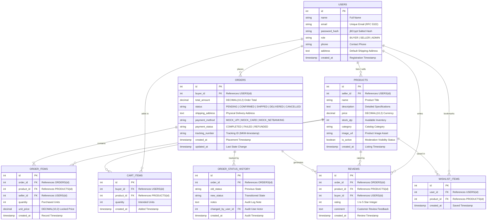

# D1: Entity-Relationship (ER) Diagram
**Project:** MonikaMart E-Commerce Platform  
**Curriculum:** Anna University R2025, Semester 3 Capstone  
**Target Database:** MySQL / H2 Relational Database  

---

## 1. Architectural ER Model (Mermaid)

---

## 2. Relational Integrity & Constraints Analysis

1. **Monetary Precision:** All currency fields (`products.price`, `orders.total_amount`, `order_items.unit_price`) use `DECIMAL(10,2)` to prevent floating-point IEEE-754 rounding inaccuracies during financial checkout calculations.
2. **Cardinality & Relationships:**
   - A `User` (as Seller) owns `0..N` `Products`.
   - A `User` (as Buyer) places `0..N` `Orders` and `0..N` `Reviews`.
   - An `Order` contains `1..N` `OrderItems` and transitions through `1..N` `OrderStatusHistory` records.
   - A `Product` is referenced by `0..N` `OrderItems`, `0..N` `CartItems`, `0..N` `Reviews`, and `0..N` `WishlistItems`.
3. **Database Normalization:** Fully normalized to Third Normal Form (3NF). Historical unit prices are locked into `order_items.unit_price` so that subsequent price revisions by merchants do not mutate past transactional historical invoices.
4. **Referential Cascades:** Deleting a user cascade-removes their active cart items, while completed financial transactions maintain audit trails.
