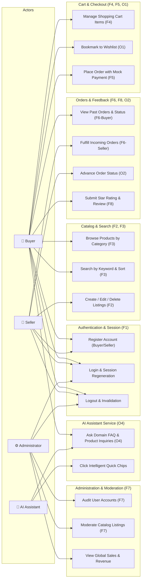

# D2: Unified Use Case Diagram
**Project:** MonikaMart E-Commerce Platform  
**Curriculum:** Anna University R2025, Semester 3 Capstone  
**Actors:** Buyer, Seller, System Administrator, AI Chatbot Concierge  

---

## 1. System Use Case Diagram (Mermaid)

---

## 2. Actor Privilege & Security Boundary Specification

| Actor | Target Role in DB | Accessible Portals | Enforced Boundary Checks |
| :--- | :--- | :--- | :--- |
| **Buyer** | `BUYER` | `/products`, `/cart/*`, `/checkout/*`, `/orders/*`, `/wishlist/*`, `/reviews/add`, `/api/chat` | Cannot access merchant inventory forms or administrative system tables. Reviews restricted to verified delivered orders. |
| **Seller** | `SELLER` | `/seller/dashboard`, `/seller/products`, `/seller/orders`, `/seller/status-update` | Can only view, mutate, or fulfill products and orders containing items manufactured/sold by their own `seller_id`. |
| **Administrator** | `ADMIN` | `/admin/dashboard`, `/admin/users`, `/admin/listings`, `/admin/moderate` | Seed account only. Has global governance over listings, users, and transactions. |
| **Guest / Public** | `Unauthenticated` | `/login`, `/register`, `/products`, `/product-detail`, `/api/v1/health` | Read-only access to catalog. Write mutations and cart operations require authenticated HTTP session. |
